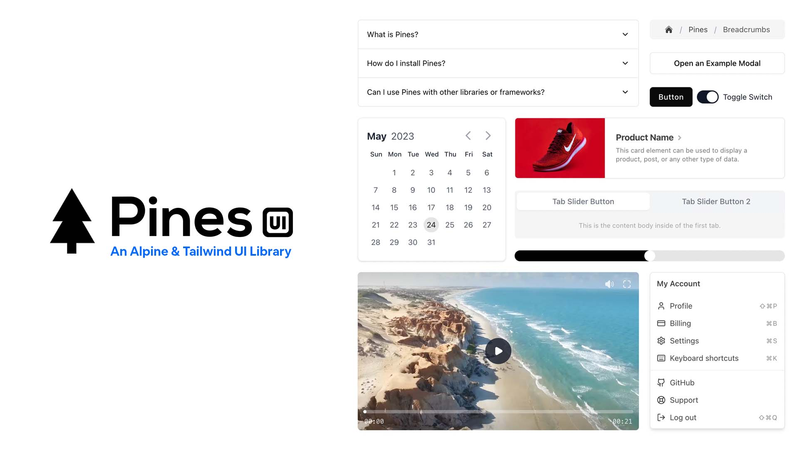

# Pines UI Library

This is the main repo for the Open Source <a href="https://devdojo.com/pines" target="_blank">Pines UI Library</a>. This repo is simple to setup and get running on your local if you wish to submit a fix or make some additions to the library.

1. Download the contents of the Github repo and store it in a folder.
2. Make sure you have <a href="https://nodejs.org/" target="_blank">NodeJS</a> installed along with the <a href="https://www.npmjs.com/package/http-server" target="_blank">http-server</a> package.
3. CD into your folder and run `http-serve` 
4. Visit the localhost URL to see PinesUI

Be sure to visit <a href="https://devdojo.com/questions" target="_blank">DevDojo discussions</a> section to ask questions and get assistance.

## License

The Pines UI Library is open-sourced software licensed under the [MIT license](https://opensource.org/licenses/MIT).
